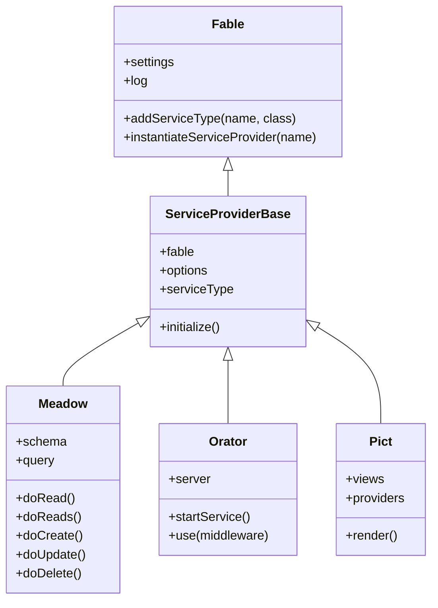
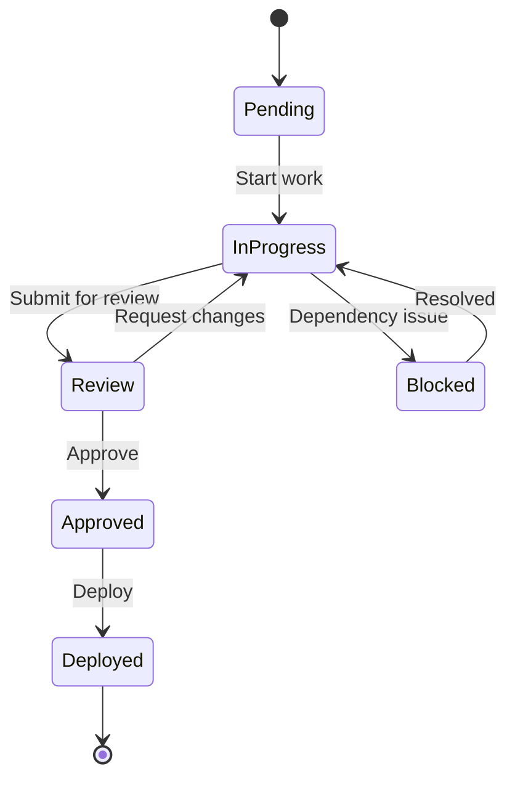
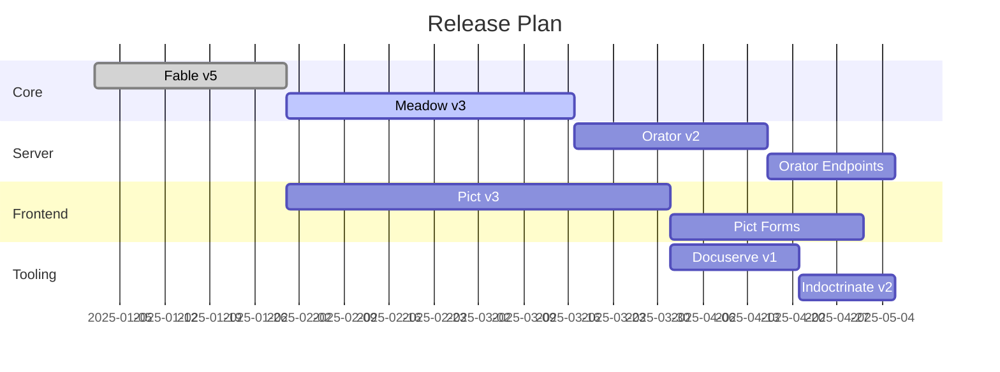
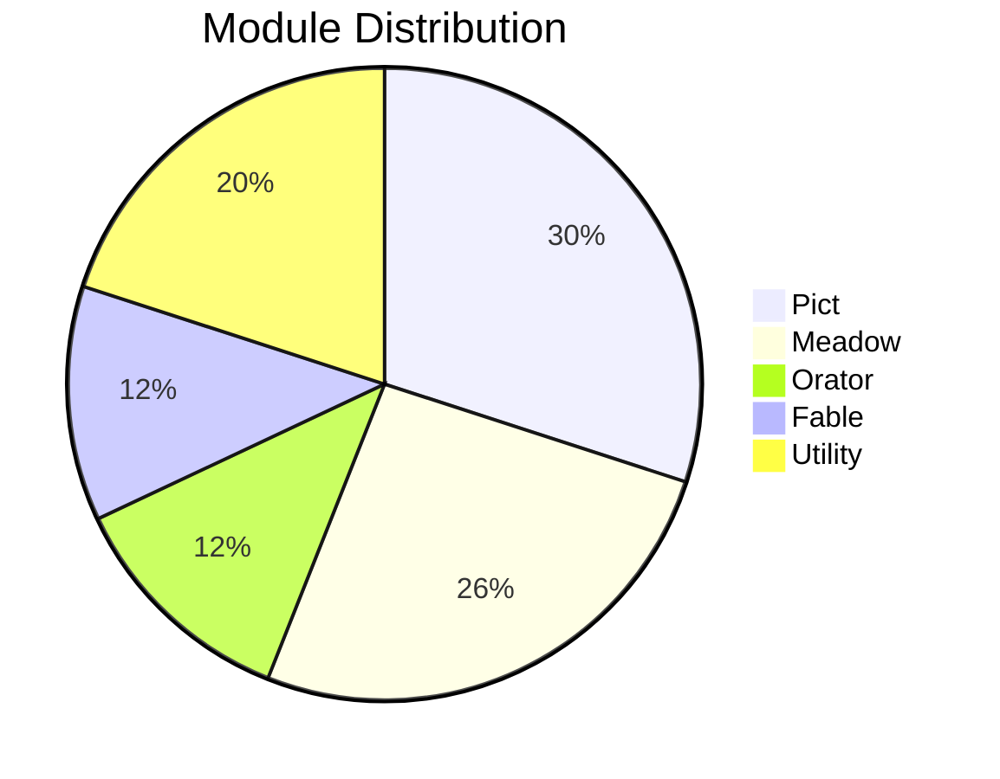
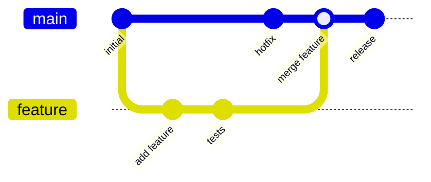

# Diagrams

Docuserve supports [Mermaid](https://mermaid.js.org/) diagrams out of the box. Any fenced code block with the language `mermaid` is automatically rendered as an interactive diagram.

## Flowcharts

Flowcharts describe processes and decision trees.

<!-- bespoke diagram: edit diagrams/flowcharts.mmd or .hints.json, then: npx pict-renderer-graph build modules/pict/pict-docuserve/docs -->


**Source:**

````
<!-- bespoke diagram: edit diagrams/flowcharts-2.mmd or .hints.json, then: npx pict-renderer-graph build modules/pict/pict-docuserve/docs -->

````

### Horizontal flowchart

Use `graph LR` for left-to-right layouts.

<!-- bespoke diagram: edit diagrams/horizontal-flowchart.mmd or .hints.json, then: npx pict-renderer-graph build modules/pict/pict-docuserve/docs -->


**Source:**

````
<!-- bespoke diagram: edit diagrams/horizontal-flowchart-2.mmd or .hints.json, then: npx pict-renderer-graph build modules/pict/pict-docuserve/docs -->

````

## Sequence Diagrams

Sequence diagrams show interactions between participants over time.

<!-- bespoke diagram: edit diagrams/sequence-diagrams.mmd or .hints.json, then: npx pict-renderer-graph build modules/pict/pict-docuserve/docs -->


**Source:**

````
<!-- bespoke diagram: edit diagrams/sequence-diagrams-2.mmd or .hints.json, then: npx pict-renderer-graph build modules/pict/pict-docuserve/docs -->

````

## Class Diagrams

Class diagrams describe object-oriented structures and relationships.



**Source:**

````

````

## State Diagrams

State diagrams model the lifecycle of an entity.



**Source:**

````

````

## Entity Relationship Diagrams

ER diagrams show database tables and their relationships.

<!-- bespoke diagram: edit diagrams/entity-relationship-diagrams.mmd or .hints.json, then: npx pict-renderer-graph build modules/pict/pict-docuserve/docs -->


**Source:**

````
<!-- bespoke diagram: edit diagrams/entity-relationship-diagrams-2.mmd or .hints.json, then: npx pict-renderer-graph build modules/pict/pict-docuserve/docs -->

````

## Gantt Charts

Gantt charts show project timelines and task dependencies.



**Source:**

````

````

## Pie Charts

Pie charts show proportional data.



**Source:**

````

````

## Git Graph

Git graphs visualize branch history and merge strategies.



**Source:**

````

````

## Tips

- Mermaid is loaded from CDN. An internet connection is required for diagrams to render.
- If Mermaid is unavailable, the raw diagram source is displayed as a code block.
- Mermaid supports many more diagram types. See the [Mermaid documentation](https://mermaid.js.org/intro/) for the full reference.
- Keep diagrams focused. Complex diagrams with dozens of nodes become hard to read. Split them into smaller diagrams if needed.
